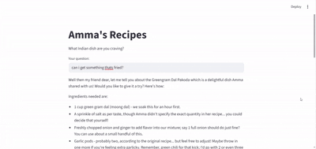

# South Indian recipe advisor
This project is a RAG system that turns my mom's South Indian recipes—dishes like dosa, sambar, idli, rasam, and appam that I grew up eating—into an interactive Q&A bot. Ask questions like "How does Amma make crispy dosa?" or "Ingredients for lemon rasam without garlic?" and get accurate, grounded responses pulled directly from her recipes.

Unique twist: Fine-tuned embeddings on South Indian recipe language (e.g., terms like "urad dal" or "tempering with mustard seeds") for better accuracy. Runs locally on CPU (no cloud, keeps family recipes private).

See what it looks like ⬇️

